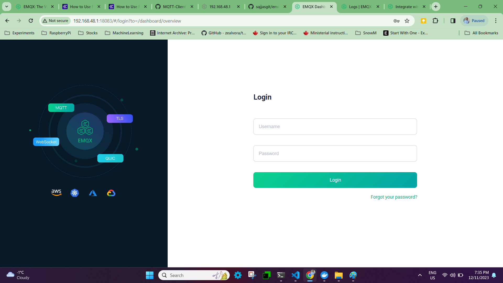
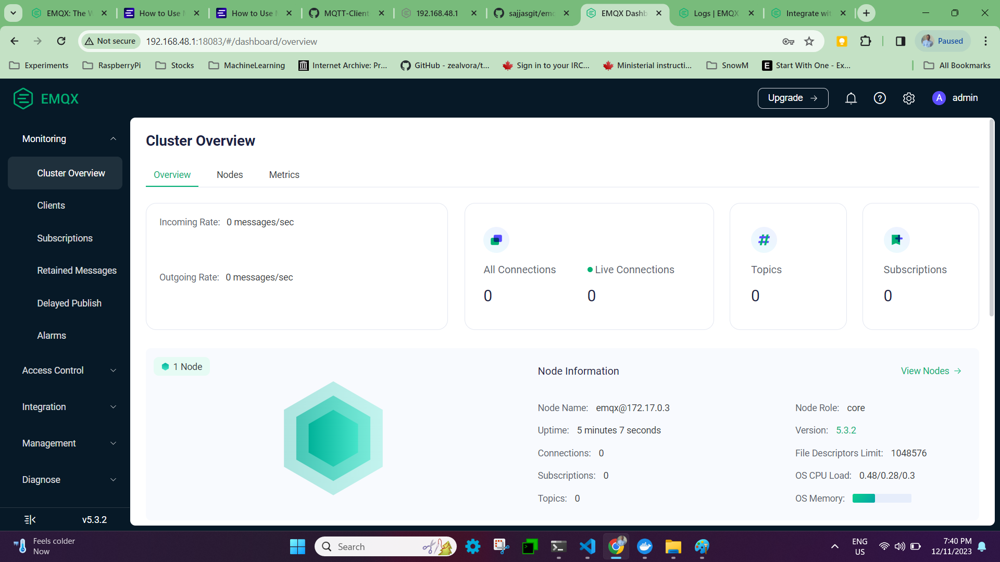
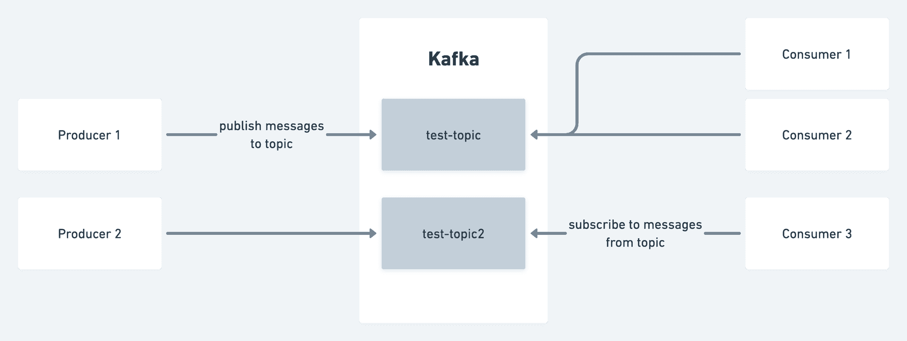
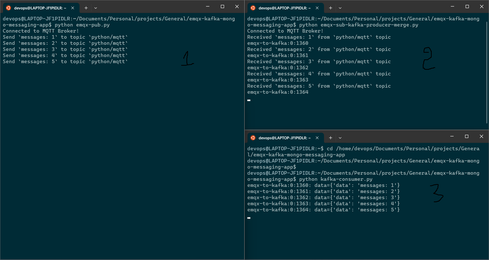
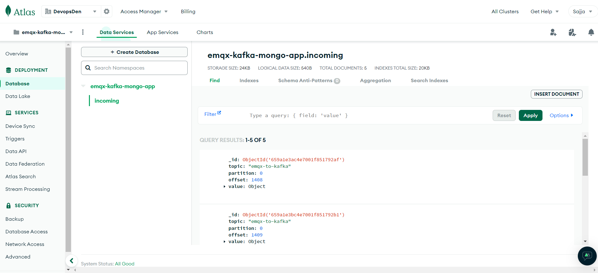

# EMQX KAFKA AND MONGO MESSAGE PROCESSING APPLICATION
The goal of this document is to use Kafka to process massive amounts of data from Internet of Things (IOT) devices in an efficient manner. However, since Kafka was not intended for IOT devices, the integration of EMQX—which uses the MQTT lightweight protocol—with Kafka can elevate a variety of opportunities to process the data in real-time, greatly benefiting time-sensitive applications.

## Introduction
### EMQX
EMQX is an open-source, highly scalable, and feature-rich MQTT broker designed for IoT and real-time messaging applications. It supports up to 100 million concurrent IoT device connections per cluster while maintaining a throughput of 1 million messages per second and a millisecond latency.

EMQX supports various protocols, including MQTT (3.1, 3.1.1, and 5.0), HTTP, QUIC, and WebSocket. It also provides secure bi-directional communication with MQTT over TLS/SSL and various authentication mechanisms, ensuring reliable and efficient communication infrastructure for IoT devices and applications.

### KAFKA
Apache Kafka is a widely used open-source distributed event streaming platform that can handle the real-time transfer of data streams between applications and systems. However, Kafka is not built for edge IoT communication and Kafka clients require a stable network connection and more hardware resources. In the IoT realm, data generated from devices and applications are transmitted using the lightweight MQTT protocol. EMQX’s integration with Kafka/Confluent enables users to stream MQTT data seamlessly into or from Kafka. MQTT data streams are ingested into Kafka topics, ensuring real-time processing, storage, and analytics. Conversely, Kafka topics data can be consumed by MQTT devices, enabling timely actions.

We will accomplish the following architecture in this tutorial.


## Setting up EMQX
### Step 1: Running EMQX service
When setting up the emqx server locally, Docker is a really helpful tool. It can remove a lot of steps and allow us to run the emqx server configuration with just two commands, as shown below.

```docker
docker pull emqx/emqx
docker run -d --name emqx -p 1883:1883 -p 8083:8083 -p 8084:8084 -p 8883:8883 -p 18083:18083 emqx/emqx
```

We can also pull and execute the emqx docker image on the Windows computer by using docker desktop.


EMQX supports the following message transmission protocols, and once you run the docker image, you should be able to see the logs that contain the details about the ports on which emqx services are running. The listener in EMQX is set up to receive requests from MQTT clients.

    - TCP: port 1883
    - SSL: port 8883
    - Websocket listener: 8083
    - Secure websocket listener: 8084
    - For UI Dashboard: 18083
 


In EMQX, Dashboard is a web-based graphic interface to manage and monitor EMQX and connected devices in real time.
 Access the endpoint `<ipaddress>:18083`



Login into the dashboard using default credentials.

```
username: admin
password: public
```
Upon logging in for the first time, you will be prompted to reset your password, which will then take you to the emqx dashboard.



### Step 2: Create emqx publisher/subscriber files using python programming

- #### Step 1: using paho-mqtt python module
    This article primarily explains how to use the paho-mqtt client and construct message, connection, and subscription functions in Python between the MQTT client and MQTT broker.

- #### Step 2: Install the Paho Mqtt Client
    `pip3 install paho-mqtt`

- #### Step 3: Create a emqx python publisher.
    ```
    from paho.mqtt import client as mqtt_client
    import random
    import logging
    import time

    # Create an MQTT Connection
    broker      = '192.168.48.1'
    port        = 1883
    topic       = "python/mqtt"
    client_id   = f'python-mqtt-{random.randint(0, 1000)}'
    username    = "admin"
    password    = "public"

    # Auto reconnect for reliable connection
    FIRST_RECONNECT_DELAY   = 1
    RECONNECT_RATE          = 2
    MAX_RECONNECT_COUNT     = 12
    MAX_RECONNECT_DELAY     = 60

    # on_connect callback function for connecting the broker.
    # This function is called after client call has successfully connected.

    def connect_mqtt():
        def on_connect(client, userdata, flags, rc):
            if rc == 0:
                print("Connected to MQTT Broker!")
            else:
                print("Failed to connect, return code %d\n", rc)
        
        def on_disconnect(client, userdata, rc):
            logging.info("Disconnected with result code: %s", rc)
            reconnect_count, reconnect_delay = 0, FIRST_RECONNECT_DELAY
            while reconnect_count < MAX_RECONNECT_COUNT:
                logging.info("Reconnecting in %d seconds...", reconnect_delay)
                time.sleep(reconnect_delay)
            
                try:
                    client.reconnect()
                    logging.info("Reconnected successfully!")
                    return
                except Exception as err:
                    logging.error("%s. Reconnect failed. Retrying...", err)

                reconnect_delay *= RECONNECT_RATE
                reconnect_delay = min(reconnect_delay, MAX_RECONNECT_DELAY)
                reconnect_count += 1
            logging.info("Reconnect failed after %s attempts. Exiting...", reconnect_count)

        # Set connecting Client ID
        client = mqtt_client.Client(client_id)
        client.username_pw_set(username, password)
        client.on_connect = on_connect
        client.connect(broker, port)
        client.on_disconnect = on_disconnect
        return client

    # publisher code
    def publish(client):
        msg_count = 1
        while True:
            time.sleep(1)
            msg = f"messages: {msg_count}"
            result = client.publish(topic, msg)
            status = result[0]
            if status == 0:
                print(f"Send `{msg}` to topic `{topic}`")
            else:
                print(f"Failed to send message to topic {topic}")
            msg_count += 1
            if msg_count > 5:
                break

    def run():
        client = connect_mqtt()
        client.loop_start()
        publish(client)
        client.loop_forever()

    if __name__ == "__main__":
        run()
    ```

- #### Step 4: Create a emqx python subscriber.
    ```
    import random
    from paho.mqtt import client as mqtt_client

    # Create an MQTT Connection
    broker      = '192.168.48.1'
    port        = 1883
    topic       = "python/mqtt"
    client_id   = f'subscribe-{random.randint(0, 1000)}'
    username    = "admin"
    password    = "public"

    def connect_mqtt() -> mqtt_client:
        def on_connect(client, userdata, flags, rc):
            if rc == 0:
                print("Connected to MQTT Broker!")
            else:
                print("Failed to connect, return code %d\n", rc)

        client = mqtt_client.Client(client_id)
        client.username_pw_set(username, password)
        client.on_connect = on_connect
        client.connect(broker, port)
        return client

    def subscribe(client: mqtt_client):
        def on_message(client, userdata, msg):
            print(f"Received `{msg.payload.decode()}` from `{msg.topic}` topic")

        client.subscribe(topic)
        client.on_message = on_message

    def run():
        client = connect_mqtt()
        subscribe(client)
        client.loop_forever()

    if __name__ == "__main__":
        run()
    ```

    > **_NOTE:_** These two files are quite basic; the publisher will send five messages before stopping, and the subscriber will be in an endless loop of receiving messages from the publisher. You can modify the publisher logic to transmit messages continuously by deleting the block below.
    ```
    msg_count += 1
        if msg_count > 5:
            break
    ```

- #### Step 5: Execute the subscriber and Publisher
    Run the publisher program in a separate terminal session after completing the subscriber program in the first one. The result should look somewhat like this:

    

<h3 style="text-align: center;"> *** End of EMQX setup *** </h3>

## Setting up KAFKA (Assuming on Ubuntu platform)

For those who are unfamiliar with Kafka, the diagram below provides a high-level explanation of the concept. (there is lot more to Kafka, such Zookeeper, Consumer Groups, Partitions, etc., but we will leave it for another time.)



Kafka divides data into topics, which are categories or feed names to which records are published. Producers publish messages to a particular topic. These messages can take any format; popular formats are JSON and Avro. For instance, on a social media platform, a producer may publish messages to a topic called posts each time a user creates a post. Consumers subscribe to a topic in order to consume the records published by producers. In the example given for the social media platform, there may be a consumer set up to consume the posts topic in order to verify the post's safety before it is published to the global feed, and another consumer may asynchronously send notifications to the user's followers.

### Step 1: Installing Java
Since Oracle Java is now commercially accessible, we are using its open-source version OpenJDK. Apache Kafka can be operated on any platform that supports Java. To install Kafka on an Ubuntu server, follow these steps.

```
sudo apt update 
sudo apt install default-jdk
```
```
java --version
openjdk 17.0.9 2023-10-17
OpenJDK Runtime Environment (build 17.0.9+9-Ubuntu-122.04)
OpenJDK 64-Bit Server VM (build 17.0.9+9-Ubuntu-122.04, mixed mode, sharing)
```

### Step 2: Download latest apache kafka
```
wget https://dlcdn.apache.org/kafka/3.6.1/kafka_2.13-3.6.1.tgz
```

Extract the archive file,
```
tar -xzf kafka_2.13-3.6.1.tgz
sudo mv kafka_2.13-3.6.1 /usr/local/kafka
```

### Step 3: Running Kafka service.
Now that we have two options for starting the Kafka service, we can choose to run it as a unix service. Alternatively, we can navigate to /usr/local/kafka/bin and run the Kafka script each time.
    
> **_NOTE:_** ZooKeeper or KRaft can be used to start Apache Kafka; in this post, we will use ZooKeeper Flow rather of both.
    
- #### Step 1 - Creating System Unit Files
    ```
    sudo nano /etc/systemd/system/zookeeper.service
    ```

    And add the following content:

    ```
    [Unit]
    Description=Apache Zookeeper server
    Documentation=http://zookeeper.apache.org
    Requires=network.target remote-fs.target
    After=network.target remote-fs.target

    [Service]
    Type=simple
    ExecStart=/usr/local/kafka/bin/zookeeper-server-start.sh /usr/local/kafka/config/zookeeper.properties
    ExecStop=/usr/local/kafka/bin/zookeeper-server-stop.sh
    Restart=on-abnormal

    [Install]
    WantedBy=multi-user.target
    ```

    Save the file and close it.

    Next, to create a system unit file for the kafka service:

    ```
    sudo nano /etc/systemd/system/kafka.service
    ```

    Add the following content:

    ```
    [Unit]
    Description=Apache Kafka Server
    Documentation=http://kafka.apache.org/documentation.html
    Requires=zookeeper.service

    [Service]
    Type=simple
    Environment="JAVA_HOME=/usr/lib/jvm/java-1.17.0-openjdk-amd64"
    ExecStart=/usr/local/kafka/bin/kafka-server-start.sh /usr/local/kafka/config/server.properties
    ExecStop=/usr/local/kafka/bin/kafka-server-stop.sh

    [Install]
    WantedBy=multi-user.target
    ```

    Reload the systemd daemon to apply new changes.

    ```
    sudo systemctl daemon-reload
    ```

- #### Step 2 - Start Kafka and Zookeeper Service
    To start Kafka, you must first start the ZooKeeper service. To start a single-node ZooKeeper instance, use the systemctl command.

    ```
    sudo systemctl start zookeeper
    ```

    Launch the Kafka server now to see the current status:

    ```
    sudo systemctl start kafka
    sudo systemctl status kafka
    ```

    ```
    devops@LAPTOP-JF1PIDLR:~/Documents/Personal/projects/General/emqx-kafka-mongo-messaging-app$ sudo vi /etc/systemd/system/kafka.service
    ● kafka.service - Apache Kafka Server
     Loaded: loaded (/etc/systemd/system/kafka.service; disabled; vendor preset: enabled)
     Active: active (running) since Tue 2023-12-12 13:41:12 EST; 6s ago
       Docs: http://kafka.apache.org/documentation.html
   Main PID: 50201 (java)
      Tasks: 83 (limit: 9396)
     Memory: 315.5M
     CGroup: /system.slice/kafka.service
             └─50201 /usr/lib/jvm/java-1.17.0-openjdk-amd64/bin/java -Xmx1G -Xms1G -server -XX:+UseG1GC -XX:MaxGCPauseMillis=20 -XX:InitiatingHeapOccupancyPercent=35 -XX:+ExplicitGCInvokesConcurrent -XX:MaxInlineLevel=15 -D>

    Dec 12 13:41:17 LAPTOP-JF1PIDLR kafka-server-start.sh[50201]: [2023-12-12 13:41:17,600] INFO [Controller id=0, targetBrokerId=0] Client requested connection close from node 0 (org.apache.kafka.clients.NetworkClient)
    Dec 12 13:41:17 LAPTOP-JF1PIDLR kafka-server-start.sh[50201]: [2023-12-12 13:41:17,614] INFO [/config/changes-event-process-thread]: Starting (kafka.common.ZkNodeChangeNotificationListener$ChangeEventProcessThread)
    Dec 12 13:41:17 LAPTOP-JF1PIDLR kafka-server-start.sh[50201]: [2023-12-12 13:41:17,634] INFO [SocketServer listenerType=ZK_BROKER, nodeId=0] Enabling request processing. (kafka.network.SocketServer)
    Dec 12 13:41:17 LAPTOP-JF1PIDLR kafka-server-start.sh[50201]: [2023-12-12 13:41:17,638] INFO Awaiting socket connections on 0.0.0.0:9092. (kafka.network.DataPlaneAcceptor)
    Dec 12 13:41:17 LAPTOP-JF1PIDLR kafka-server-start.sh[50201]: [2023-12-12 13:41:17,651] INFO Kafka version: 3.6.1 (org.apache.kafka.common.utils.AppInfoParser)
    Dec 12 13:41:17 LAPTOP-JF1PIDLR kafka-server-start.sh[50201]: [2023-12-12 13:41:17,652] INFO Kafka commitId: 5e3c2b738d253ff5 (org.apache.kafka.common.utils.AppInfoParser)
    Dec 12 13:41:17 LAPTOP-JF1PIDLR kafka-server-start.sh[50201]: [2023-12-12 13:41:17,652] INFO Kafka startTimeMs: 1702406477646 (org.apache.kafka.common.utils.AppInfoParser)
    Dec 12 13:41:17 LAPTOP-JF1PIDLR kafka-server-start.sh[50201]: [2023-12-12 13:41:17,653] INFO [KafkaServer id=0] started (kafka.server.KafkaServer)
    Dec 12 13:41:17 LAPTOP-JF1PIDLR kafka-server-start.sh[50201]: [2023-12-12 13:41:17,843] INFO [zk-broker-0-to-controller-forwarding-channel-manager]: Recorded new controller, from now on will use node LAPTOP-JF1PIDLR.:9092 (>
    Dec 12 13:41:17 LAPTOP-JF1PIDLR kafka-server-start.sh[50201]: [2023-12-12 13:41:17,861] INFO [zk-broker-0-to-controller-alter-partition-channel-manager]: Recorded new controller, from now on will use node LAPTOP-JF1PIDLR.:9
    ```

    This completes the installation of Kafka. The next section of the tutorial will assist you in interacting with the Kafka server.

### Step 4: Create a Topic in Kafka
To begin working with Kafka, create a topic called "emqx-to-kafka" with a single partition and a single replica. Kafka provides several pre-built shell scripts for this purpose.

```
cd /usr/local/kafka
bin/kafka-topics.sh --create --bootstrap-server localhost:9092 --replication-factor 1 --partitions 1 --topic emqx-to-kafka

Created topic emqx-to-kafka.
```

You can run the same command above to create multiple topics. After that, you can run the following command to see the created topics on Kafka. The replication factor specifies how many copies of data will be created. Since we are running with a single instance, keep this value 1. Set the partition options as the number of brokers you want your data to be split between.

```
devops@LAPTOP-JF1PIDLR:/usr/local/kafka$ bin/kafka-topics.sh --list --bootstrap-server localhost:9092

emqx-to-kafka
```

Moreover, you can use the describe command to view information like the new topic's partition count:

```
devops@LAPTOP-JF1PIDLR:/usr/local/kafka$ bin/kafka-topics.sh --describe --topic emqx-to-kafka --bootstrap-server localhost:9092
Topic: emqx-to-kafka    TopicId: BPDpQiOvQ2WDGWPn45d99w PartitionCount: 1       ReplicationFactor: 1    Configs: 
        Topic: emqx-to-kafka    Partition: 0    Leader: 0       Replicas: 0     Isr: 0
```

### Step 4: Writing event into Kafka topic

Run the producer client to write a few events into your topic. By default, each line you enter will result in a separate event being written to the topic. A Kafka client communicates with the Kafka brokers via the network for writing (or reading) events. Once the brokers receive the events, they will store them for as long as you need—even forever.

```
bin/kafka-console-producer.sh --topic emqx-to-kafka --bootstrap-server localhost:9092
>
```

> **_NOTE:_** In this case, `>` indicates that it entered a prompt and requested that you add messages, which will be transmitted to the designated topic and the Kafka broker.


Example instance,
```
devops@LAPTOP-JF1PIDLR:/usr/local/kafka$ bin/kafka-console-producer.sh --topic emqx-to-kafka --bootstrap-server localhost:9092
>
>First kafka producer message
>Second Kafka producer message
>
```

Ctrl-C can be used to end the producer client at any moment.

### Step 5: Reading the eventn from Kafka topic
To read the events you just created, open a second terminal session and launch the consumer client:

```
devops@LAPTOP-JF1PIDLR:/usr/local/kafka$ bin/kafka-console-consumer.sh --topic emqx-to-kafka --from-beginning --bootstrap-server localhost:9092

First kafka producer message
Second Kafka producer message
```

The consumer client can be stopped at any moment by using Ctrl-C. It began reading the buffered messages as soon as you hit the consumer command.

Feel free to get hands-on: for instance, write more events by switching back to your producer terminal (previous step), and observe how the events appear instantly in your consumer terminal. Events in Kafka are durably stored, so you can read them as many times as you would like by opening another terminal session and repeating the previous command.

> **_NOTE:_** An option in the kakfa to select the location to read the messages from makes it very important to ensure consistency with data and avoid redundant records in time-sensitive applications.
>    ```
>    --offset earlier/latest
>    ```

>    The default value for this flag is latest, which implies that Kafka will read only messages with the most recent offset value if you do not specify it. The alternative is earliest, which indicates that Kafka will read messages from the offset where it read the most recent message.

>    For instance, if we assume 0 1 2 and 3 4 5 are the producer messages and assume kafka red and processed 0 1 2. Later, due to some glitch, kafka service was restarted. In case of "latest," it will wait for new messages to come in and skip 3 4 5 messages; in case of "earliest," it will start reading from 3 4 5 and then latest

>    In the event that there is a lag in the kafka, the application may receive outdated entries if it is expecting real-time data and is using the earlier option.

Thus far, we have examined how to set up Kafka and handle messages using the CLI. The next step involves sending and receiving Kafka messages using the Python programming language.

### Step 6: Kafka producer python module

```
import json
from logging import log
from kafka import KafkaProducer
from kafka.errors import KafkaError

# produce json messages
# configure multiple retries
# produce asynchronously with callbacks
producer = KafkaProducer(bootstrap_servers=['localhost:9092'],
                         retries=5,
                         value_serializer=lambda m: json.dumps(m).encode('ascii'))

def on_send_success(record_metadata):
    print("%s:%d:%d" % (record_metadata.topic, 
                                 record_metadata.partition,
                                 record_metadata.offset))

def on_send_error(excp):
    log.error('I am an errback', exc_info=excp)
    # handle exception

for item in range(10):
    producer.send('emqx-to-kafka', {item: 'awesome-' + str(item**2)}).add_callback(on_send_success).add_errback(on_send_error)

# block until all async messages are sent
producer.flush()
```

### Step 7: Kafka consumer python module

```
import json
from kafka import KafkaConsumer

# To consume latest messages and auto-commit offsets
# consume json messages
# StopIteration if no message after 1sec
# auto_offset_reset='earliest', enable_auto_commit=False
consumer = KafkaConsumer(bootstrap_servers='localhost:9092',
                         auto_offset_reset='latest', 
                         enable_auto_commit=True,
                         consumer_timeout_ms=1000,
                         value_deserializer=lambda m: json.loads(m.decode('ascii')))

# Subscribe to a regex topic pattern
consumer.subscribe(pattern='^emqx.*')

while True:
    for message in consumer:
        # message value and key are raw bytes -- decode if necessary!
        # e.g., for unicode: `message.value.decode('utf-8')`
        print ("%s:%d:%d: data=%s" % (message.topic, message.partition,
                                            message.offset, message.value))
```


<h3 style="text-align: center;"> *** End of Kafka setup *** </h3>

## EMQX + KAFKA together

After learning how EMQX and Kafka function separately up till now, it is time to combine the two to achieve better outcomes. To do this, simply combine the logics of EMQX subscribers and Kafka producers. The combined output will look like this:

```
import random
import json
from logging import log
from kafka import KafkaProducer
from kafka.errors import KafkaError
from paho.mqtt import client as mqtt_client

# Create an MQTT Connection
broker      = '192.168.48.1'
port        = 1883
topic       = "python/mqtt"
client_id   = f'subscribe-{random.randint(0, 1000)}'
username    = "admin"
password    = "public"

# produce json messages
# configure multiple retries
# produce asynchronously with callbacks
producer = KafkaProducer(bootstrap_servers=['localhost:9092'],
                         retries=5,
                         value_serializer=lambda m: json.dumps(m).encode('ascii'))

def connect_mqtt() -> mqtt_client:
    def on_connect(client, userdata, flags, rc):
        if rc == 0:
            print("Connected to MQTT Broker!")
        else:
            print("Failed to connect, return code %d\n", rc)

    client = mqtt_client.Client(client_id)
    client.username_pw_set(username, password)
    client.on_connect = on_connect
    client.connect(broker, port)
    return client

def subscribe(client: mqtt_client):
    def on_message(client, userdata, msg):
        print(f"Received `{msg.payload.decode()}` from `{msg.topic}` topic")
        producer.send('emqx-to-kafka', {"data": msg.payload.decode()}).add_callback(on_send_success).add_errback(on_send_error)
        # block until all async messages are sent
        producer.flush()

    client.subscribe(topic)
    client.on_message = on_message

def run():
    client = connect_mqtt()
    subscribe(client)
    client.loop_forever()

def on_send_success(record_metadata):
    print("%s:%d:%d" % (record_metadata.topic, 
                                 record_metadata.partition,
                                 record_metadata.offset))

def on_send_error(excp):
    log.error('I am an errback', exc_info=excp)
    # handle exception

if __name__ == "__main__":
    run()
```

The primary and most significant modification to the current EMQX subscriber logic is that, in addition to printing the message in the subscribe function, we are now sending it to the Kafka producer as seen below.

```
def subscribe(client: mqtt_client):
    def on_message(client, userdata, msg):
        print(f"Received `{msg.payload.decode()}` from `{msg.topic}` topic")
        producer.send('emqx-to-kafka', {"data": msg.payload.decode()}).add_callback(on_send_success).add_errback(on_send_error)
        # block until all async messages are sent
        producer.flush()
```

In the end, kafka consumer will receive a message sent by emqx publisher.



Therefore, in a real-time situation, the emqx publisher logic will be implemented in IOT devices, which will regularly transmit messages and record real-time data. The data will then be processed by kafka consumers, and we will be able to store and process the data in a backend database.

We will look at storing the messages from the Kafka consumer into the Mango database in the following section.

## Processing and storing real time data into mongodb

In this section, we are going to create a python function using pymongo, a python library to interact with mongo db.
we can create a free account @ https://www.mongodb.com/. By default, we can create a free standard project in mongodb cloud console without paying anything. though there are some restrictions but for a beginer its obsolutely fine to get start.

I am not going to explain how to create cluster/project/database/collection in mongodb in this turotial but i will create a separate document for it in future.

1) Below is my mongo handler which will connect to database and store the messages into "incoming" collection.

```
from pymongo import MongoClient

def MongoInsertHandler(doc):
    uri             = "mongodb+srv://<username>:<password>@<mongo-endpoint>/?retryWrites=true&w=majority"
    collection_name = "incoming"

    try:
        client = MongoClient(uri)
    # return a friendly error if a URI error is thrown 
    except Exception as e:
        print(e)

    # use a database
    db = client["emqx-kafka-mongo-app"]

    # use a collection
    my_collection = db[collection_name]

    # INSERT DOCUMENTS
    #
    # In this example, You can insert individual documents using collection.insert_one().
    # If you are creating multiple documents then we can insert them all with insert_many().
    try:
        print("Inserting document: {}".format(doc))
        result = my_collection.insert_one(doc)
        print("Document inserted!")
    # return a friendly error if the operation fails
    except Exception as e:
        print(e)

# if __name__ == "__main__":
#     document = {"hello": "HI"}
#     MongoInsertHandler(document)
```

2) As a next step, I will integrate this mongo handler into kafka consumer. When kafka consumer receives message from kafka producer, it will insert that message into mongodb. before calling the mongo handler, I am formatting the data into a json format.

```
import json
from kafka import KafkaConsumer
from mongo_handler import MongoInsertHandler

# To consume latest messages and auto-commit offsets
# consume json messages
# StopIteration if no message after 1sec
# auto_offset_reset='earliest', enable_auto_commit=False
consumer = KafkaConsumer(bootstrap_servers='localhost:9092',
                         auto_offset_reset='latest', 
                         enable_auto_commit=True,
                         consumer_timeout_ms=1000,
                         value_deserializer=lambda m: json.loads(m.decode('ascii')))

# Subscribe to a regex topic pattern
consumer.subscribe(pattern='^emqx.*')

while True:
    for message in consumer:
        # message value and key are raw bytes -- decode if necessary!
        # e.g., for unicode: `message.value.decode('utf-8')`
        print ("%s:%d:%d: data=%s" % (message.topic, message.partition,
                                            message.offset, message.value))
        document = {"topic": message.topic, "partition": message.partition, "offset": message.offset, "value": message.value}
        MongoInsertHandler(document)
```

In the existing kafka consumer logic, I have appended the below lines in a while loop.

```
document = {"topic": message.topic, "partition": message.partition, "offset": message.offset, "value": message.value}
MongoInsertHandler(document)
```

As you can see on screen 3, document is getting inserted up on receiving in kafka consumer. In the next image, you can also find the records inserted in the collection in the mongodb cloud console.

<h3 style="text-align: center;"> *** End of Tutorial *** </h3>
