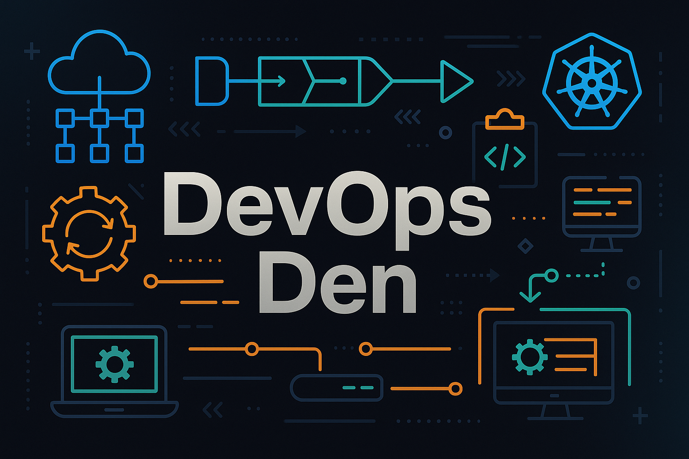

---
date:
  created: 2024-11-13
---
<!-- # 🚀 DevOps Den – Knowledge Hub

Welcome to **DevOps Den**, your all-in-one platform for modern DevOps practices. Whether you're just starting out or scaling enterprise pipelines, this space is built to help you **learn**, **build**, and **automate** with confidence.

---

## 📚 Table of Contents

- [🔧 CI/CD Pipelines](#ci-cd-pipelines)
- [⚙️ Infrastructure as Code (IaC)](#infrastructure-as-code-iac)
- [🧪 Testing & Quality](#testing--quality)
- [📊 Monitoring & Observability](#monitoring--observability)
- [🔐 DevSecOps & Security](#devsecops--security)
- [🧩 Containers & Kubernetes](#containers--kubernetes)
- [🧰 Tools & Ecosystem](#tools--ecosystem)
- [🌟 Featured Project](#featured-project-kubernetes-auto-scaling-demo)
- [👥 Community & Contributions](#community--contributions)
- [📬 Stay Connected](#-stay-connected)

---

## 🔧 CI/CD Pipelines

Automate builds, tests, and deployments across platforms:

- GitHub Actions, Jenkins, GitLab CI/CD
- Best practices: environment isolation, rollback strategies, deployment previews
- [🚀 Guide to GitHub Actions (Coming Soon)](#)

---

## ⚙️ Infrastructure as Code (IaC)

Provision and manage your infrastructure through code:

- Tools: Terraform, Pulumi, AWS CDK
- Cloud providers: AWS, Azure, GCP
- [🌱 Terraform 101 for Cloud Engineers (Coming Soon)](#)

---

## 🧪 Testing & Quality

Catch bugs early and deliver with confidence:

- Unit, Integration, E2E Testing in CI/CD
- Static code analysis, code coverage reports
- [🧼 Automating Quality Gates in DevOps (Coming Soon)](#)

---

## 📊 Monitoring & Observability

Gain visibility and reduce downtime:

- Prometheus, Grafana, Loki, ELK
- Alerts, logs, traces, metrics
- [📈 Building a Monitoring Stack with Prometheus (Coming Soon)](#)

---

## 🔐 DevSecOps & Security

Integrate security into your pipelines:

- Secrets management (Vault, SOPS)
- SAST, DAST tools (SonarQube, OWASP ZAP)
- [🛡️ DevSecOps Best Practices for CI/CD (Coming Soon)](#)

---

## 🧩 Containers & Kubernetes

Ship and run software at scale:

- Docker, Podman, container registries
- Kubernetes basics, Helm, Kustomize, ArgoCD
- [☸️ Kubernetes Crash Course (Coming Soon)](#)

---

## 🧰 Tools & Ecosystem

| Tool             | Category           | Description                           |
|------------------|--------------------|---------------------------------------|
| Docker 🐳        | Containers          | Build and run apps in containers      |
| Kubernetes ☸️     | Orchestration       | Manage container clusters             |
| Terraform 🌱     | Infrastructure as Code | Provision cloud resources           |
| Jenkins ⚙️       | CI/CD               | Orchestrate pipeline jobs             |
| GitHub Actions 🤖 | CI/CD               | Native automation with GitHub         |
| Prometheus 📈    | Monitoring          | Time-series metrics and alerts        |
| Grafana 📊       | Dashboards          | Data visualization                    |

---

## 🌟 Featured Project: Kubernetes Auto-Scaling Demo

Deploy a real-world app on Kubernetes using GitHub Actions and HPA (Horizontal Pod Autoscaler):

- CI/CD with GitHub Actions
- Helm for packaging and release
- Auto-scaling based on CPU load

👉 **[View Tutorial ➡️](#)** (coming soon)

---

## 👥 Community & Contributions

We welcome your contributions! Join us to:

- ✍️ Write articles or tutorials
- 🛠️ Share project demos
- 📢 Spread DevOps best practices

🧭 Check out our [Contributing Guidelines](CONTRIBUTING.md)

---

## 📬 Stay Connected

- ⭐ Star the repo to support this project
- 🔄 Fork it and make it your own
- 💬 Reach out via [GitHub Discussions](#) or [email](mailto:your@email.com)

> DevOps is a journey. Let's walk it together. 🌍

--- -->

---
layout: default
title: DevOps Den
---

👉 Got questions or feedback? [Join our GitHub Discussions](https://github.com/devops-den/articles/discussions)

# 🚀 Welcome to DevOps Den

Learn and share DevOps practices with real-world projects, visual workflows, and hands-on tutorials.

## 🧭 Start Here

| 📘 Topic            | 🌟 Beginner-Friendly Guide                    |
|---------------------|----------------------------------------------|
| CI/CD Pipelines     | [GitHub Actions 101](guides/github-actions.md) |
| Infrastructure as Code | [Terraform Quick Start](guides/terraform.md) |
| Kubernetes          | [First Deployment](guides/kubernetes.md)       |
| Monitoring & Logs   | [Intro to Prometheus](#)   |
| Secrets Management  | [Vault in 5 Minutes](#)         |

---

## 📢 What’s New

- ✅ Terraform GCP VPC Module added
- 🧪 GitHub Actions with Test Matrix support
- 🔐 Added DevSecOps pipeline template

---

## 📚 Blog Highlights

📝 [Building Secure CI/CD Pipelines](blog/secure-cicd.md)  
🐳 [Docker Tips You Wish You Knew Earlier](blog/docker-tips.md)

---

## 💬 Connect With Us

- 🗣️ [GitHub Discussions](https://github.com/devops-den/articles/discussions)
- ⭐ [Star this Repo](https://github.com/devops-den/articles)
- 📫 Subscribe to Newsletter: [Coming Soon]
